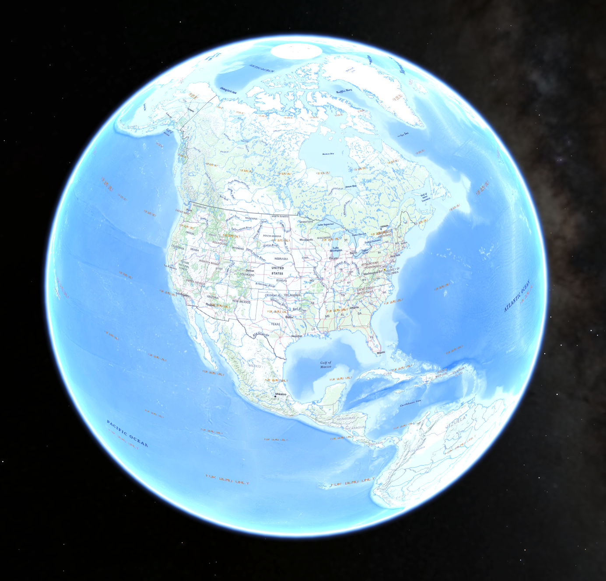
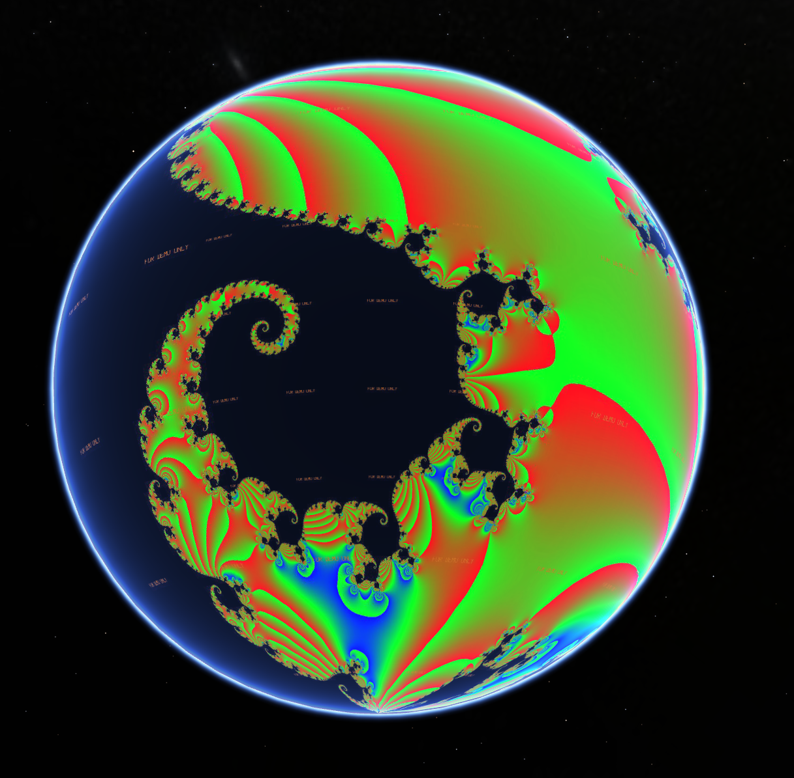

# Another Google Earth Server

Proof-of-concept Google Earth Enterprise Fusion server alternative, written in Go.

This project is archived.  Please reach out if there's any value here for you.

# Background

Historically Google Earth Fusion services were used to manage and merge raster imagery for delivery to Goolge Earth Enterprise.

Fusion has been abandoned and unsupported for years, and very few organizations are best off creating their own raster backgrounds.

This code is an example of easily proxying tiled raster maps for delivery to Google Earth Enterprise Clients.

# Functionality

 - Basic metadata provider: implemented
 - Raster imagery provider:  implemented
 - Terrain provider: proxy only
 - Vector provider: unimplemented

## Example Imagery

